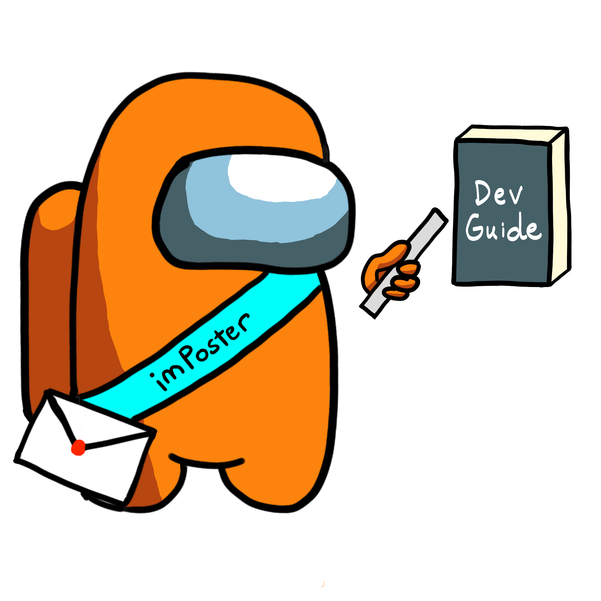
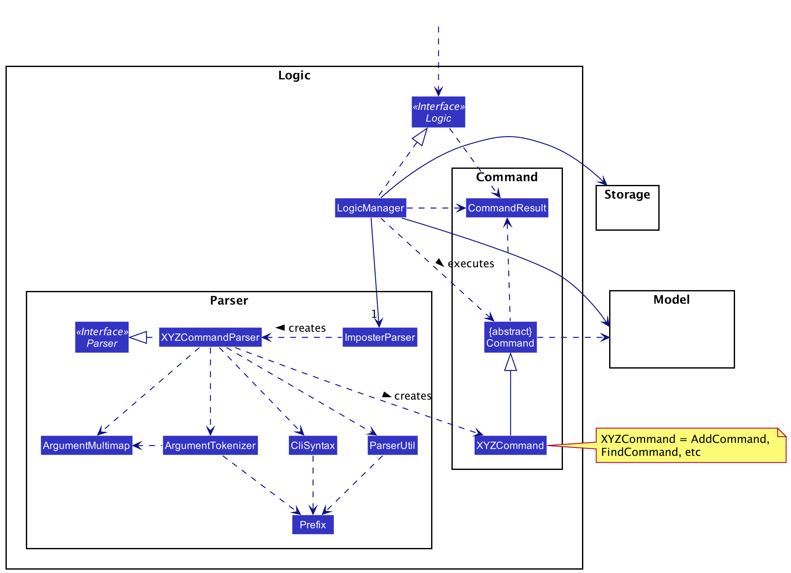

* Table of Contents 
{:toc}

---

## **Design**

### Architecture

The ***Architecture Diagram*** given above explains the high-level design of the App. Given below is a quick overview of each component.

**`Main`** has two classes called [`Main`](https://github.
com/AY2021S2-CS2103T-T12-4/tp/blob/master/src/main/java/seedu/us/among/Main.java) and [`ImPoster`](https://github.
com/AY2021S2-CS2103T-T12-4/tp/blob/master/src/main/java/seedu/us/among/ImPoster.java). They are responsible for,
* At app launch: Initializes the components in the correct sequence, and connects them up with each other.
* At shut down: Shuts down the components and invokes cleanup methods where necessary.

[**`Commons`**](#common-classes) represents a collection of classes used by multiple other components.

The rest of the App consists of four components.

* [**`UI`**](#ui-component): The UI of the App.
* [**`Logic`**](#logic-component): The command executor.
* [**`Model`**](#model-component): Holds the data of the App in memory.
* [**`Storage`**](#storage-component): Reads data from, and writes data to, the hard disk.

Each of the four components,

* defines its *API* in an `interface` with the same name as the Component.
* exposes its functionality using a concrete `{Component Name}Manager` class (which implements the corresponding API `interface` mentioned in the previous point.

For example, the `Logic` component (see the class diagram given below) defines its API in the `Logic.java` interface and exposes its functionality using the `LogicManager.java` class which implements the `Logic` interface.

**How the architecture components interact with each other**

The *Sequence Diagram* below shows how the components interact with each other for the scenario where the user 
issues the command `sen1 1`.

The sections below give more details of each component.

### UI component

### Model component

### Storage component

--------------------------------------------------------------------------------------------------------------------

## **Appendix A: Product Scope**

**Target user profile**:

- has a need to test a significant number of APIs
- prefers a quick means of testing APIs
- can type fast
- prefers typing to mouse interactions
- is reasonably comfortable with APIs
- is keen to develop software products that involve APIs
- requires testing of APIs in projects or work-related tasks

**Value proposition**:

- beautify response
- save requests for quick execution again
- general analysis/recommendation system based on certain metrics
- no need to create any account
- simple and easy to get started
- unintrusive
- great user experience

## **Appendix B: User Stories**

Priorities: High (must have) - `* * *`, Medium (nice to have) - `* *`, Low
(unlikely to have) - `*`

| Priority | As a …​               | I want to …​                              | So that I can…​                                                 |
| -------- | --------------------- | ----------------------------------------- | --------------------------------------------------------------- |
| `* * *`  | new user              | view a quick description of APIs          | quickly review the concepts of APIs                             |
| `* * *`  | long time user        | test my APIs on the fly                   | run API tests anytime                                           |
| `* * *`  | long time user        | quickly load my previous APIs             | save time and not have to type them all out again               |
| `* * *`  | experienced developer | test out my API multiple times repeatedly | know if my API can cope under significant traffic               |
| `* * *`  | new API developer     | clear error messages                      | quickly learn where I went wrong                                |
| `* * *`  | API tester            | a focused simple design                   | quickly validate the state of an endpoint                       |
| `* * *`  | new user              | have an optional features walkthrough     | have a broad overview of functionalities                        |
| `* * *`  | moderate user         | find/locate saved API endpoints           | can easily view the information for the endpoint of my interest |
| `*`      | experienced developer | export my saved API endpoints             | can easily port or integrate the data with other platforms      |
| `*`      | expert user           | have API recommendations                  | help to optimise or are more suited for my product              |
| `*`      | moderate user         | learn to optimise my usage                | can have a faster and smoother workflow                         |

_{More to be added}_

## **Appendix C: Use Cases**

(For all use cases below, the **System** is the `imPoster` and the **Actor** is
the `user`, unless specified otherwise)

### <ins>General Use Cases</ins>

**Use case G01 - View Help**

**MSS**

1.  User requests for help with using the application
2.  User enters help command into command box
3.  imPoster returns a help link for the user to click

    Use case ends.

**Extensions**

- 2a. The given command/format is invalid

  - 2a1. imPoster shows an error message to the user

    Use case resumes at step 2.

**Use case G02 - Exit imPoster**

**MSS**

1.  User requests to exit the application
2.  User enters exit command into command box
3.  imPoster exits

    Use case ends.

**Extensions**

- 2a. The given command/format is invalid

  - 2a1. imPoster shows an error message to the user

    Use case resumes at step 2.

### <ins>Endpoint Use Cases</ins>

**Use case E01 - Add an API endpoint**

**MSS**

1.  User requests to add an API endpoint
2.  User enters add command into command box
3.  imPoster saves the API endpoint to the API endpoint list

    Use case ends.

**Extensions**

- 2a. The given command/format is invalid

  - 2a1. imPoster shows an error message to the user

    Use case resumes at step 2.

**Use case E02 - Edit an API endpoint**

**MSS**

1.  User requests to edit an API endpoint
2.  User enters edit command into command box
3.  imPoster edits the API endpoint and updates the API endpoint list

    Use case ends.

**Extensions**

- 2a. The given command/format is invalid

  - 2a1. imPoster shows an error message to the user

    Use case resumes at step 2.

- 2b. The given index is invalid

  - 2b1. imPoster shows an error message to the user

    Use case resumes at step 2.

**Use case E03 - Remove an API endpoint**

**MSS**

1.  User requests to remove an API endpoint
2.  User enters remove command into command box
3.  imPoster removes the API endpoint and updates the API endpoint list

    Use case ends.

**Extensions**

- 2a. The given command/format is invalid

  - 2a1. imPoster shows an error message to the user

    Use case resumes at step 2.

- 2b. The given index is invalid

  - 2b1. imPoster shows an error message to the user

    Use case resumes at step 2.

**Use case E04 - Find a saved API endpoint**

**MSS**

1.  User requests to find a saved API endpoint
2.  User enters find command into command box
3.  imPoster searches the existing records
4.  imPoster returns a list of matching API endpoints

    Use case ends.

**Extensions**

- 2a. The given command/format is invalid

  - 2a1. imPoster shows an error message to the user

    Use case resumes at step 2.

- 2b. The given search result is empty

  - 2b1. imPoster shows a friendly message about mistyped keywords to the user

    Use case resumes at step 1.

**Use case E05 - List all saved API endpoints**

**MSS**

1.  User requests to view all saved API endpoints
2.  User enters list command into command box
3.  imPoster displays all existing records

    Use case ends.

**Extensions**

- 2a. The given command/format is invalid

  - 2a1. imPoster shows an error message to the user

    Use case resumes at step 2.

**Use case E06 - Clear all saved API endpoints**

**MSS**

1.  User requests to clear all saved API endpoints
2.  User enters clear command into command box
3.  imPoster clears all existing records

    Use case ends.

**Extensions**

- 2a. The given command/format is invalid

  - 2a1. imPoster shows an error message to the user

    Use case resumes at step 2.

**Use case E07 - Call a saved API endpoint**

**MSS**

1.  User requests to call a saved API endpoint
2.  User enters send command into command box
3.  imPoster makes a call to the desired API endpoint
4.  API call is successful and response is shown to the user
5.  imPoster saves the response to a file that the user can view

    Use case ends.

**Extensions**

- 2a. The given command/format is invalid

  - 2a1. imPoster shows an error message to the user

    Use case resumes at step 2.

- 2b. imPoster receives an invalid index

  - 2b1. imPoster shows an error message to the user

    Use case resumes at step 2.

- 3a. imPoster receives a status code indicating an error

  - 3a1. imPoster forwards and shows the error message (from the server, if any)
    to the user

    Use case resumes at step 1.

**Use case E08 - Call an API endpoint directly without saving**

**MSS**

1.  User requests to call a saved API endpoint
2.  User enters run command into command box
3.  imPoster makes a call to the desired API endpoint
4.  API call is successful and response is shown to the user
5.  imPoster saves the response to a file that the user can view

    Use case ends.

**Extensions**

- 2a. The given command/format is invalid

  - 2a1. imPoster shows an error message to the user

    Use case resumes at step 2.

- 3a. imPoster receives a status code indicating an error

  - 3a1. imPoster forwards and shows the error message (from the server, if any)
    to the user

    Use case resumes at step 1.

*{More to be added}*

### Non-Functional Requirements

1.  Should work on any _mainstream OS_ as long as it has Java `11` or above
    installed.
2.  Should be able to hold up to 1000 API endpoints without a noticeable
    sluggishness in performance for typical usage.
3.  A user with above average typing speed for regular English text (i.e. not
    code, not system admin commands) should be able to accomplish most of the
    tasks faster using commands than using the mouse.
4.  Should feel simple and easy to use as compared to existing
    solutions such as [Postman](https://www.postman.com/).
5.  Should be able to provide a proper response even if a call to an API
    endpoint fails due to third-party unavailability.
6.  Should not crash or throw unexpected errors when internet connection is
    unavailable.

_{More to be added}_

### Glossary

- **Mainstream OS**: Windows, Linux, Unix, OS-X
- **Endpoint/API endpoint**: The point of entry in a communication channel for two
  systems to interact
- **API Call/Call**: A process where information is transferred, processed and a response is returned
- **Postman**: An existing API client for developers

_{More to be added}_

## **Appendix D: Developer Workflow**
 
Please checkout the [workflow guide](https://ay2021s2-cs2103t-t12-4.github.io/tp/WorkflowGuide.html) to understand
the adopted approach in maintaining imPoster.
